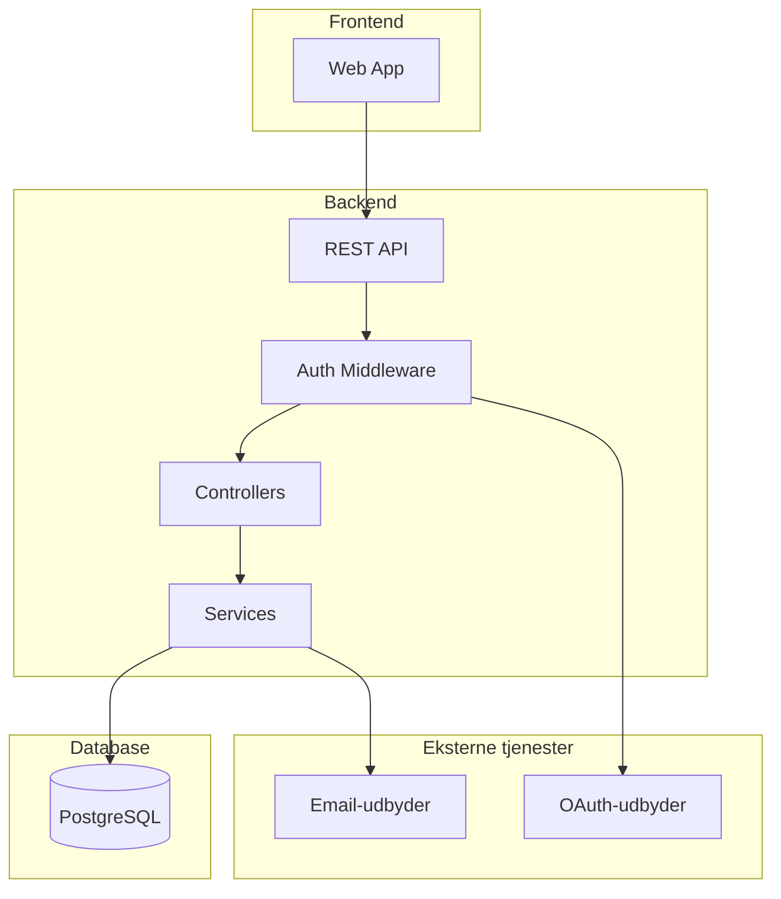

# Teknisk Systemdokumentation

**Sidst opdateret:** [YYYY-MM-DD]
**Vedligeholdt af:** [Team/ansvarlig]
**Relateret:** [ARCHITECTURE.md](ARCHITECTURE.md) (designbeslutninger), [FEATURES.md](FEATURES.md) (acceptkriterier)

---

## Indholdsfortegnelse

1. [System-overblik](#1-system-overblik)
2. [Autentificering og autorisering](#2-autentificering-og-autorisering)
3. [Datamodel](#3-datamodel)
4. [Integrations](#4-integrations)
5. [Infrastruktur og deployment](#5-infrastruktur-og-deployment)
6. [Known issues](#6-known-issues)

---

## 1. System-overblik

### Arkitekturdiagram



### Tech Stack

| Lag | Teknologi | Formål |
|-----|-----------|--------|
| **Frontend** | [fx React 18, TypeScript, Vite] | [Formål] |
| **UI-komponenter** | [fx shadcn/ui, Tailwind CSS] | [Formål] |
| **State management** | [fx Zustand, React Query] | [Formål] |
| **Backend** | [fx Express, TypeScript] | [Formål] |
| **ORM** | [fx Prisma] | [Formål] |
| **Database** | [fx PostgreSQL] | [Formål] |
| **Autentificering** | [fx JWT + OAuth2] | [Formål] |
| **Infrastruktur** | [fx Docker, VPS/Cloud] | [Formål] |

---

## 2. Autentificering og autorisering

### Auth-flow

```text
[Beskriv auth-flowet — fx magic link, OAuth, password]
```

### Roller og tilladelser

| Rolle | Kan |
|-------|-----|
| `ADMIN` | Alt |
| `USER` | Egne ressourcer |
| [Tilføj roller] | [Tilladelser] |

### Token-konfiguration

| Token | Levetid | Opbevaring |
|-------|---------|------------|
| Access token | [fx 15 min] | Memory (ikke localStorage) |
| Refresh token | [fx 7 dage] | HttpOnly cookie |

---

## 3. Datamodel

### Kernemodeller

```text
[Model A]
 ├── id: UUID
 ├── [felt]: [type]
 └── createdAt: DateTime

[Model B]
 ├── id: UUID
 ├── [Model A]Id: UUID  →  [Model A]
 └── [felt]: [type]
```

### Vigtige konventioner

- **Soft delete:** [fx Status-enum frem for sletning — CONFIRMED/CANCELLED/COMPLETED]
- **Datoer:** Gemmes i UTC, vises i brugerens tidszone
- **Status-værdier:** UPPERCASE strings — aldrig lowercase

---

## 4. Integrations

### [Integration 1 — fx Email]

**Formål:** [Hvad bruges det til]
**Udbyder:** [Navn]
**Konfiguration:** `[ENV_VAR_NAME]` i environment variables

```text
[Beskriv flow — fx hvornår sendes emails, hvilke typer]
```

### [Integration 2 — fx OAuth]

**Formål:** [Hvad bruges det til]
**Udbyder:** [Navn]
**Konfiguration:** `[CLIENT_ID]` og `[CLIENT_SECRET]`

---

## 5. Infrastruktur og deployment

### Miljøer

| Miljø | URL | Branch | Opdateres ved |
|-------|-----|--------|---------------|
| Production | `https://app.[projekt].dk` | `main` | Merge til main |
| Test | `https://test.[projekt].dk` | `develop` | Push til develop |
| Dev | `http://localhost:3000` | lokalt | Manuel start |

### Environment Variables

| Variabel | Krævet | Beskrivelse |
|----------|--------|-------------|
| `DATABASE_URL` | ✅ | PostgreSQL connection string |
| `JWT_SECRET` | ✅ | Hemmelighed til JWT-signering (min 32 tegn) |
| `JWT_EXPIRES_IN` | ✅ | Access token levetid — fx `15m` |
| `JWT_REFRESH_EXPIRES_IN` | ✅ | Refresh token levetid — fx `7d` |
| `NODE_ENV` | ✅ | `production` \| `development` \| `test` |
| `[INTEGRATION_KEY]` | ❌ | [Beskrivelse — hvornår kræves den] |

### Deployment-procedure

```bash
# Normal release (develop → main)
# 1. Verificér test-miljø er sundt
curl -s https://test.[projekt].dk/api/health | jq

# 2. Opret release PR
gh pr create --base main --head develop --title "Release: $(date +%Y-%m-%d)"

# 3. Merge og overvåg
gh pr merge <nr> --squash && gh run watch
```

Se `/release` skill for fuld checkliste.

### Health check

```bash
curl -s https://app.[projekt].dk/api/health
# Forventet: { "status": "ok", "timestamp": "..." }
```

### Rollback

```bash
git checkout main && git pull
git revert -m 1 <merge-commit-sha>
git push
# → trigger nyt deployment med revert
```

### Database-migrationer

```bash
npx prisma migrate dev     # development
npx prisma migrate deploy  # production (kører automatisk ved deploy)
```

---

## 6. Known issues

| Problem | Symptom | Workaround | Issue |
|---------|---------|------------|-------|
| [Beskriv problem] | [Hvad oplever man] | [Midlertidig løsning] | #[nr] |
